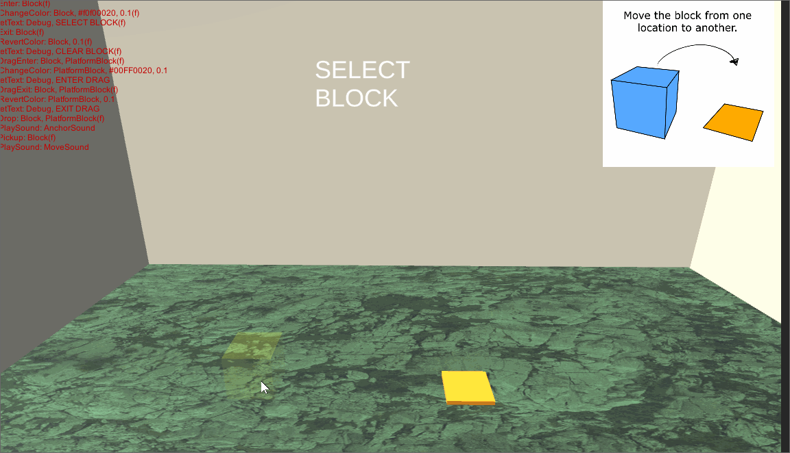
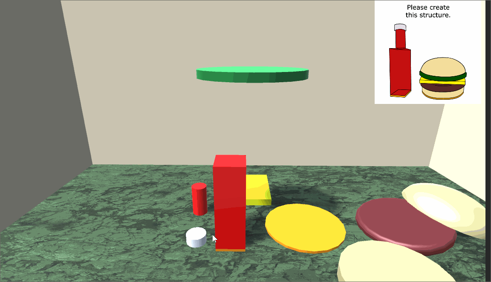

# Getting Started

To enable the framework in Unity, simply add a `GameLoop` component to one of
the assets in your scene hierarchy.

## GameLoop Arguments

The `GameLoop` takes the following arguments.

* **Game Config File (Mandatory)**: Input text file containing the sequence of behaviors that implements your game. 
* **interactableLayerMask (Optional)**: Layer for selecting and dragging interactable objects. (Default Value: 8)
* DebugOptions (Optional)
   * **tree**: Display the state of the behavior tree while the game is running 
   * **selection**: Display debug information for selecting and dragging objects.
* LogOptions
   * **enabled**: Toggle whether logging is enabled
   * **verbose**: Toggle whether log text should be printed to console as well as saved to file baseName: Set the filename for the log. The name format is "Application.persistentDataPath/baseName-timestamp.txt"

# Tutorials

* [Squirrel House](#squirrel-house): 2D interaction, animation, and sound
* [Animate Demo](#animate-demo): 2D procedural animation 
* [One Block](#one-block): Simple 3D interaction
* [Block Puzzle](#block-puzzle): 3D interaction with custom behavior

### Squirrel House

 <video width="100%" controls>
  <source src='../images/SquirrelHouse.mp4' type="video/mp4">
  Your browser does not support the video tag.
</video> 

This demo shows how to trigger sounds and animation based on dragging and dropping objects.
From `BasicExample/Assets/Scene`, open `SquirrelHouse.unity`. 

This is a 2D demo. All assets are stored under the `HUD` object which is configured with a canvas object. 
The scene was created from the basic 3D scene. All game elements are stored under `HUD`.

* For music, we show and hide the object `Music` which is configured with an AudioSource component.
* For the dance animation, we add an animation component to `Squirrel` and `SquirrelDance` to it. We make sure to configure the animation so it does not play automatically.
* Drag and drop is configured using `Anchor` objects. The `Anchor` under the `BoomBox` asset indicates where the casette should snap when the user lets go of it. Otherwise, the casette will remain at the position where the user let go. The `Anchor` is offset slightly in the Z direction so that the colliders for the casette and BoomBox do not overlap (which would interfere with the raycast selection). 
* All other objects are simple images and text.

Here is the behavior script. 

```
Fade: Message, 0, 1, 2.0
Repeat:
  IfPickup: Casette
    Hide: Music
    StopAnimation: Squirrel, SquirrelDance
  End
  IfDrop: Casette, BoomBox
    PlayAnimation: Squirrel, SquirrelDance
    Show: Music
  End
End
```

The root node of the behavior tree is always a sequence node, meaning the following script runs the 
`Fade` behavior followed by the `Repeat` behavior. 

Notes:

* `Fade` changes the alpha, or transparency, for an asset. The syntax is `Fade: <AssetName>, <StartAlpha>, <EndAlpha>, <Duration>`
* `Repeat` repeats the IfDrag and IfDrop conditionals forever.
* `IfPickup` triggers if the user picks up the casette asset. When true, the two sub-behaviors are executed in parallel (e.g. simultaneously)
* `IfDrop` triggers if the user drops the casette on top of the BoomBox. When true, the two sub-behaviors are executed in parallel (e.g. simultaneously)
* `PlayAnimation` plays the `SquirrelDance` animation on the `Squirrel` asset.


### Animated Star

 <video width="100%" controls>
  <source src='../images/AnimateDemo.mp4' type="video/mp4">
  Your browser does not support the video tag.
</video> 

This demo shows how to animate assets from a script. 
From `BasicExample/Assets/Scene`, open `AnimatedStar.unity`. 

The framework contains commands for moving, rotating, resizing, fading, and
changing the colors of assets. The configuration of the scene is very simple.
For example, the following script shows a messages, increases the size of the Star
asset, then changes its color, and then moves it around the screen.

```
# Test built-in animators
SetText: Message, Start Demo
Fade: Panel, 0, 1, 2.0
Grow: Star, 0.1, 1.0, 1.0
SetText: Message, Demo
ChangeColor: Star, #FF00FFFF, 1.0
ChangeColor: Star, #00FFFFFF, 1.0
RevertColor: Star, 2.0
Move: Star, Waypoint1, Waypoint2, 2.0
Move: Star, Waypoint2, Waypoint3, 2.0, Cosine
Move: Star, Waypoint3, Waypoint1, 3.0, EaseIn
Pulse: Star, 2
SetText: Message, Demo Complete
Fade: Panel, 1, 0, 2.0
```

Notes:

* To move and rotate objects, set waypoints (e.g. empty game objects) with the desired starting and end states. Both the position and rotations of the waypoints will be used for animation.
* Colors should be RGB coordinates, each component in the range 0 and 1.
* `SetText` changes the text on the `Message` asset.
* `Fade` changes the alpha, or transparency, for an asset. The syntax is `Fade: <AssetName>, <StartAlpha>, <EndAlpha>, <Duration>`
* `Grow` changes the size uniformly for an asset. The syntax is `Grow: <AssetName>, <StartSize>, <EndSize>, <Duration>`
* `ChangeColor` changes the color for an asset and all its children. The syntax is `ChangeColor: <AssetName>, <RGBA>, <Duration>`. The original colors of the asset are cached so they can be restored later.
* `RevertColor` restores the color of an asset. The syntax is `RevertColor: <AssetName>, <Duration>`
* `Move` translates and rotates an asset. The syntax is `Move: <AssetName>, <StartTransform>, <EndTransform>, <Duration>, <Interpolation Type>`. The interpolation type is optional. By default, we use linear interpolation. The start and end configuration of the 
movement is specified using Transforms in the scene. Above, we defined the transforms `Waypoint1`, `Waypoint2`, and `Waypoint3`.  
* `Pulse` quickly pulses the size of the asset. The syntax is `Pulse: <AssetName>, <NumPulses>`. It is also possible to set the speed and size of the pulse by passing these arguments as additional values, e.g. `Pulse: <AssetName>, <NumPulses>, <PulseSpeed>, <PulseSize>`. The default pulse speed is 0.4 seconds. The pulse size is a percentage of the original size and is currently 0.1, or ten percent.

### One Block



This demo shows how to configure a 3D scene with drag and drop objects. 
From `BasicExample/Assets/Scene`, open `OneBlock.unity`. 

The user feedback is configured using events that correspond to the 
`If` statements in the script. For example, 

```
InitDraggable: Block
InitLocation: PlatformBlock

Repeat:
  # Highlight the block asset yellow
  # when the user hovers over it with the mouse 
  IfEnter: Block
     ChangeColor: Block, #f0f00020, 0.1
     SetText: Debug, SELECT BLOCK
  End

  # Revert the color when the mouse is not over the block
  IfExit: Block
     RevertColor: Block, 0.1
     SetText: Debug, CLEAR BLOCK
  End

  # Color the platform transparent green when 
  # the user drags the block over it
  IfDragEnter: Block, PlatformBlock
     ChangeColor: PlatformBlock, #00FF0020, 0.1
     SetText: Debug, ENTER DRAG
  End

  # Revert the color
  IfDragExit: Block, PlatformBlock
     RevertColor: PlatformBlock, 0.1
     SetText: Debug, EXIT DRAG
  End

  # Play sounds on pickup and drop
  IfDrop: Block, PlatformBlock
     PlaySound: AnchorSound
  End
  IfPickup: Block 
     PlaySound: MoveSound
  End
End
```

Notes:

* `InitDraggable` initializes an object so a player can pick it up and drag it
* `InitLocation` initializes an object that can have an item dropped on top of it. You can 
configure where an object snaps using an *Anchor* transform that is a child transform of the object.
For example, in this demo, the `Platform` object has a child transform, named `Anchor`, that is offset by (0,1,0) 
* `IfEnter` and `IfExit` trigger when the player's mouse is over the object
* `IfDragEnter` and `IfDragExit` trigger when a dragged object is over a location where it can be dropped.
* `IfPickup` and `IfDrop` trigger when the player picks up, or drops, an object

### Block Puzzle

<video width="100%" controls>
  <source src='../images/BlockPuzzle.mp4' type="video/mp4">
  Your browser does not support the video tag.
</video> 

This demo shows how to implement a 3D drag and drop puzzle with 
more objects. From `BasicExample/Assets/Scene`, open `BlockPuzzle.unity`. 

To get started, you only need to define the locations 
of *Anchor* points in the scene and then tell the framework which 
objects can be dragged and which objects can have others attached to them.
For example, the following script initializes objects for the block puzzle.

```
InitDraggable: Cheese
InitDraggable: Patty
InitDraggable: BunTop
InitDraggable: Lettuce
InitDraggable: BunBottom
InitDraggable: Cap
InitDraggable: BottleTop
InitDraggable: BottleBottom

InitLocation: PlatformBurger
InitLocation: BunBottom
InitLocation: Patty
InitLocation: Cheese
InitLocation: Lettuce
InitLocation: PlatformBottle
InitLocation: BottleBottom
InitLocation: BottleTop
```

Using this script, the player can move objects and connect them together.
However, there is no feedback.



To add feedback, we could add rules that trigger when the user interacts 
with objects in the scene. However, this is tedious and we can automatically 
setup feedback using a custom behavior. For example, the following 
behavior monitors when events happen on every interactable object in the 
scene. When an event happens, we play sounds and change colors.

```
public class HighlightBehavior : Behavior
{
  AudioSource m_ssound;
  AudioSource m_lsound;
  Color m_scolor;
  Color m_lcolor;

  public HighlightBehavior(World w, Color sc, AudioSource ssound, 
      Color lc, AudioSource lsound) : base(w)
  {
      m_ssound = ssound;
      m_lsound = lsound;
      m_scolor = sc;
      m_lcolor = lc;
  }

  public override void Setup()
  {
     foreach (Interactable i in world.GetInteractables())
     {
         i.AddPickupCb(OnPickup);
         i.AddDropCb(OnDrop);
         i.AddHoverEnterCb(OnEnter);
         i.AddHoverExitCb(OnExit);
         i.AddDragEnterCb(OnDragEnter);
         i.AddDragExitCb(OnDragExit);
     }
  }

  void OnEnter(Interactable source)
  {
     world.Run(
        ProceduralAnimator.ChangeColor(source.transform, m_scolor, 0.03f)
     );
  }

  void OnExit(Interactable source)
  {
     world.Run(
       ProceduralAnimator.RevertColor(source.transform, 0.03f)
     );
  }

  void OnPickup(Interactable source)
  {
      m_ssound.time = 0;
      m_ssound.PlayOneShot(m_ssound.clip);
  }

  void OnDragEnter(Interactable source, GameObject target)
  {
     world.Run(
       ProceduralAnimator.ChangeColor(target.transform, m_lcolor, 0.3f)
     );
  }

  void OnDragExit(Interactable source, GameObject target)
  {
     world.Run(
       ProceduralAnimator.RevertColor(target.transform, 0.3f)
     );
  }

  void OnDrop(Interactable source, GameObject target)
  {
      if (target != null)
      {
          m_lsound.time = 0;
          m_lsound.PlayOneShot(m_lsound.clip);
      }
  }
}
```

To connect our new behavior with the script, we add a creator to `Factory`.

```
public static Behavior Highlight(World world, string args)
{
  string[] tokens = args.Split(",", 4);
  Color sc, lc;

  ColorUtility.TryParseHtmlString(tokens[0].Trim(), out sc);
  Transform sobj = world.Get(tokens[1].Trim());
  AudioSource ssound = sobj.GetComponent<AudioSource>();

  ColorUtility.TryParseHtmlString(tokens[2].Trim(), out lc);
  AudioSource lsound = world.Get(tokens[3].Trim()).GetComponent<AudioSource>();

  return new HighlightBehavior(world, sc, ssound, lc, lsound);
}
```

*Important:* Trim() is important for parsing and name lookups to work. 

After adding our new behavior, we can add the `Highlight` behavior to our script.

```
InitDraggable: Cheese
InitDraggable: Patty
InitDraggable: BunTop
InitDraggable: Lettuce
InitDraggable: BunBottom
InitDraggable: Cap
InitDraggable: BottleTop
InitDraggable: BottleBottom

InitLocation: PlatformBurger
InitLocation: BunBottom
InitLocation: Patty
InitLocation: Cheese
InitLocation: Lettuce
InitLocation: PlatformBottle
InitLocation: BottleBottom
InitLocation: BottleTop

# Out NEW HIGHLIGHT is here!
Highlight: #FFFF00FF, MoveSound, #00FF00F0, AnchorSound
```

