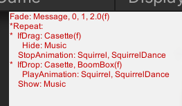

# Debuggging and Troubleshooting

The GameLoop component has options for debugging the execution of the behavior tree and 
for selection and raycasting. 

## Behavior Tree

In the `GameLoop` component, toggle Option -> Debug -> Tree to show the current state of the behavior tree. 

Currently running behaviors are prefixed with `*`. Finished behaviors are suffixed with `(f)`. 
Nested behaviors are shown with indentation.  The pause button in the Unity viewer can be used 
to step through each behavior.

### Troubleshooting behaviors

Check the console for errors. Below are a list of typical issues.

* A behavior could not be initialized because it is mispelled or has incorrect parameters.
* Multiple assets cannot have the same name. In this case, the behavior may modify an asset that you are not expecting.
* The framework only supports TextMeshPro, so modifications to Text will not work.
* If you want to change the transparency of an object, make sure it has a transparent material.
* Behaviors that change color assume that materials have a _Color attribute.
* Don't mix IfClick and IfDrag/IfDrop queries on the same asset. An asset should be either _clikable_ or _draggable_.

## Selection

In the `GameLoop` component, toggle Option -> Debug -> Selection to show additional information about selection.
This will print the names of selected, dragged, clicked, or dropped objects. In the scene view, you will also see 
raycast lines from the camera. 

### Troubleshooting selection 

* Check the collliders on your assets. If the collider for an object is missing or inaccurate, the click and selection queries will not trigger. Check the collider volumes while the game is running. 
* Check that you do not have a layer mask with value 8. The selection system puts all interactable objects onto their own layer for more efficient collision testing. The default is layer 8. If this value conflicts with other layers in your game, you can change it in the `GameLoop` component, under Options -> InteractableLayerMask.
* For 2D games, check that the canvas configuration has render mode `ScreenSpace - Camera`.
* Check that you do not have two overlapping objects with similar sized colliders on them. In this case, the selection system cannot distinguish between them. 